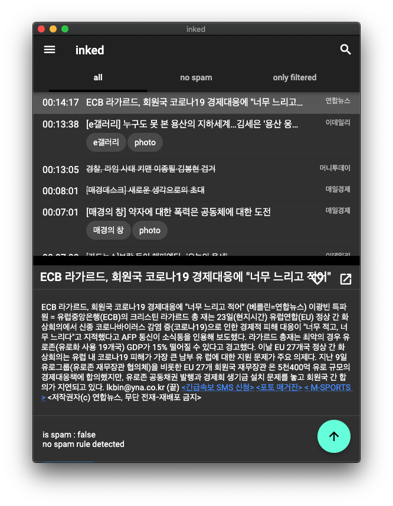
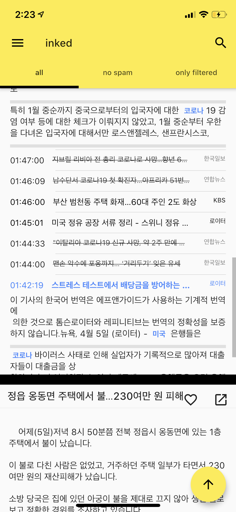

# inked

this repo is mainly evil eye - flutter ported project.
Supports
* ✅ Web
* ✅ Mac os
* ✅ Windows (no audio support) additional audio bridge on https://github.com/softmarshmallow/inked-lite
* ✅ Android / ios
* Linux (not tested yet) (no audio support)

## TODO
* deploy test server on heroku for developers' test

## Getting Started

### Code generation
`flutter pub run build_runner build`
`flutter pub run build_runner build --delete-conflicting-outputs`
`flutter pub run build_runner watch`